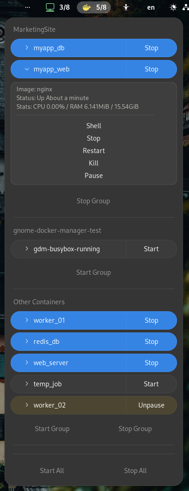

# GNOME Docker Manager Extension

Manage Docker containers from the GNOME panel. A simple, native design that fits right in with the GNOME Shell.

## Features
*   **Monitor Status:** View container status (running, paused, exited) directly from the panel.
*   **Quick Actions:** Start, stop, restart, pause, and remove containers with a single click.
*   **Terminal Access:** One-click terminal access to any running container (Shell).
*   **Live Stats:** Real-time CPU and Memory usage statistics for running containers.
*   **Bulk Management:** Start or stop all containers (or specific groups) at once.
*   **Real-time Updates:** Automatic list updates via Docker events.

## Requirements
*   **Docker:** Must be installed and running.
*   **Permissions:** Your user must be in the `docker` group (check with `groups` command).

## Installation
You can install this extension from the [GNOME Extensions website](https://extensions.gnome.org).

Alternatively, for manual installation:
1. Clone the repository.
2. Copy the contents to `~/.local/share/gnome-shell/extensions/docker-manager@omerfarukgungor`.
3. Restart GNOME Shell (or logout/login).
4. Enable the extension via GNOME Extensions or Extensions Manager.

